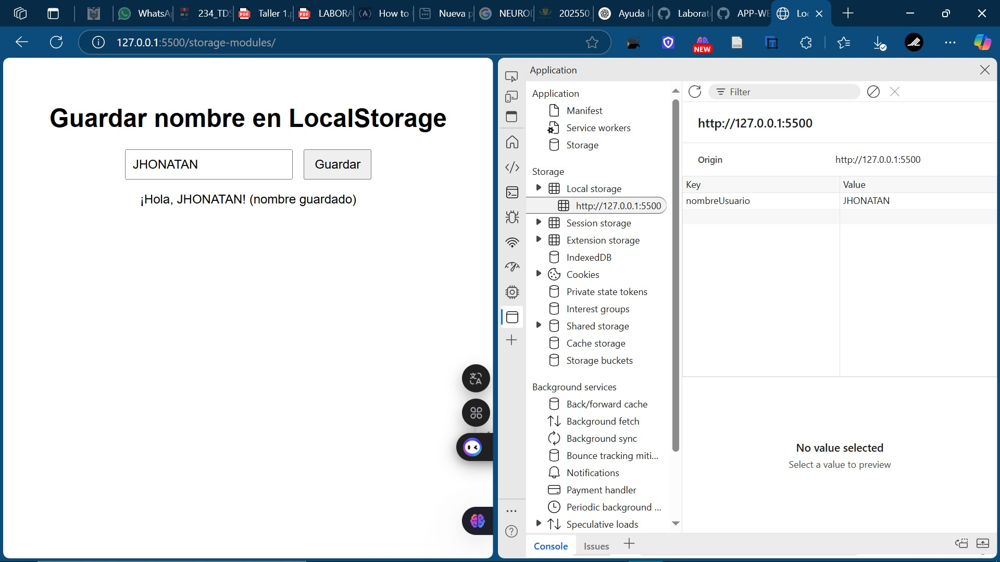

# Laboratorio 6: Desarrollo de Aplicaciones Web

## Descripción

Este proyecto corresponde al Laboratorio 6 de la asignatura **Desarrollo de Aplicaciones Web**. El objetivo principal de este laboratorio es familiarizarse con el uso de **JavaScript**, especialmente con la gestión de almacenamiento en el navegador utilizando **LocalStorage** y el manejo de **módulos** en JavaScript.

En este laboratorio, se implementa una aplicación que permite a los usuarios guardar su nombre en el **localStorage** y ver un saludo personalizado cada vez que visitan la página.

## Imagen de funcionamiento

A continuación, puedes ver una captura de pantalla de la aplicación funcionando:

## Objetivos

- Aprender a utilizar la API de **LocalStorage** para almacenar datos en el navegador.
- Trabajar con **módulos de JavaScript** para organizar el código.
- Implementar una aplicación web que interactúe con el almacenamiento local.
- Subir el proyecto a **GitHub** para su control de versiones y acceso remoto.

## Tecnologías Utilizadas

- **HTML**: Para la estructura básica de la página web.
- **CSS**: Para el estilo visual de la página.
- **JavaScript**: Para la lógica y manejo del almacenamiento local.
- **Git**: Para el control de versiones y colaboración.
- **GitHub**: Para almacenar el proyecto en línea.

## Funcionalidad

1. El usuario puede ingresar su nombre en un campo de texto.
2. Al hacer clic en el botón **"Guardar"**, el nombre se guarda en el **localStorage** del navegador.
3. Si el nombre ya está guardado, al recargar la página se muestra un saludo personalizado con el nombre guardado.

## Instrucciones para Ejecutar el Proyecto

### 2. Abrir el proyecto

Abre el archivo `index.html` en tu navegador para probar el funcionamiento de la aplicación.

### 3. Uso

* Ingresa tu nombre en el campo de texto.
* Haz clic en el botón **"Guardar"**.
* Recarga la página y verás un saludo personalizado con el nombre guardado.

### 4. Ejecutar el proyecto con un servidor local

Para una mejor experiencia, se recomienda ejecutar el proyecto a través de un servidor local. Si estás usando **Visual Studio Code**, puedes usar la extensión **Live Server** para correr el proyecto fácilmente. Si prefieres usar la línea de comandos, puedes usar la herramienta **http-server**.

## Estructura del Proyecto

El proyecto está compuesto por los siguientes archivos:

* **index.html**: Contiene la estructura básica de la página web.
* **main.js**: Implementa la lógica de la aplicación, incluyendo el manejo del almacenamiento local.
* **storage.js**: Define las funciones para guardar y obtener el nombre desde el **localStorage**.
* **style.css**: Define el estilo de la página web.