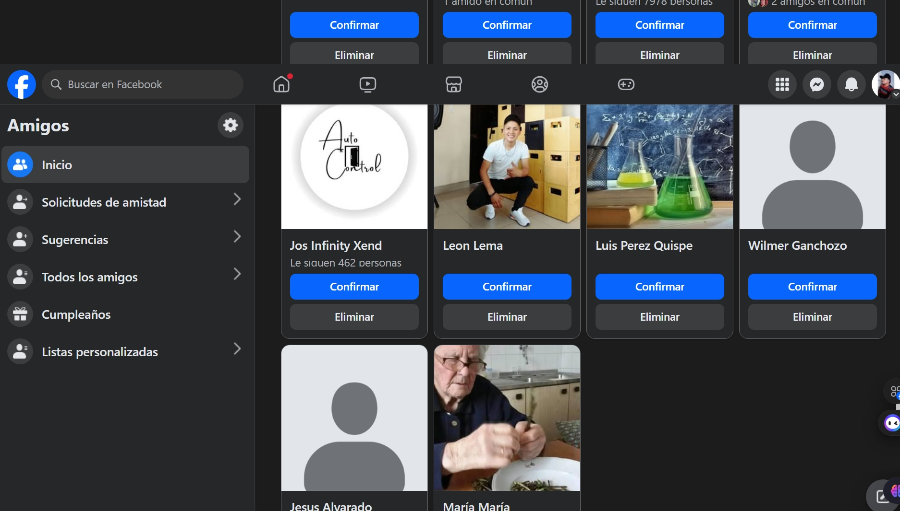

# **Laboratorio 4 - JavaScript: Objetos y Arreglos**

## **Descripción**
Este proyecto corresponde al **Laboratorio 4** de la asignatura **Desarrollo de Aplicaciones Web**, en el que se trabajaron conceptos fundamentales de **JavaScript**, tales como **objetos** y **arreglos**. El proyecto se basa en la simulación de datos de una página de **Facebook**, específicamente de la sección de **"Amigos"**.

## **Propósito**
Familiarizar al estudiante con la sintaxis básica de **JavaScript** mediante la creación de **objetos** y **arreglos**. El proyecto permite almacenar, organizar y acceder a datos de usuarios (simulados) utilizando estas estructuras fundamentales.

## **Tecnologías Utilizadas**
- **JavaScript**
- **Node.js**

## **Proceso Realizado**

# Mi Proyecto



1. **Extracción de Datos de Facebook:**
   - Se utilizó una **página de Facebook** como base para recolectar información sobre los **amigos**. De las tarjetas de perfil de los usuarios, se extrajeron datos como **nombres**, **apellidos**, **edades** y **direcciones** ficticias.
   - Estos datos fueron utilizados para crear **objetos** y **arreglos** en JavaScript, con el fin de practicar las técnicas aprendidas en clase.

### **CODIGO:**

```javascript
// Creación de un objeto de usuario con propiedades simuladas
let user = {
  name: "Jhonatan",
  lastname: "Nolasco",
  age: 23,
  address: { streets: "Av. Guatemala y Juan Soto" }
};

// Desestructuración del objeto para extraer los valores
let { name, lastname, age, address: { streets } } = user;

// Mostrar los datos del usuario en consola
console.log(name, lastname, age, streets);
```

### ** Arreglo:**

```javascript
// Arreglo con varios usuarios simulados
let users = [
  { name: "Carlos", lastname: "Pérez", age: 28, address: { streets: "Calle Foch y Av. Colón" } },
  { name: "Laura", lastname: "González", age: 24, address: { streets: "Av. Amazonas y 10 de Agosto" } },
  { name: "Felipe", lastname: "Ramírez", age: 30, address: { streets: "Calle Sucre y Av. 6 de Diciembre" } },
  { name: "María", lastname: "Martínez", age: 26, address: { streets: "Calle Naciones Unidas y Av. República" } }
];

// Desestructuración para acceder al primer amigo en el arreglo
let { name, lastname, age, address: { streets } } = users[0];

// Mostrar los datos del primer amigo en consola
console.log(name, lastname, age, streets);
```
---

## **Estructura del Proyecto**
```
LABORATORIOS/
│
├── LAB4.js        # Código JavaScript con ejemplos de objetos y arreglos.
├── README.md      # Este archivo.
```

[def]: APPWEB/LABORATORIOS/images/CAP.jpeg